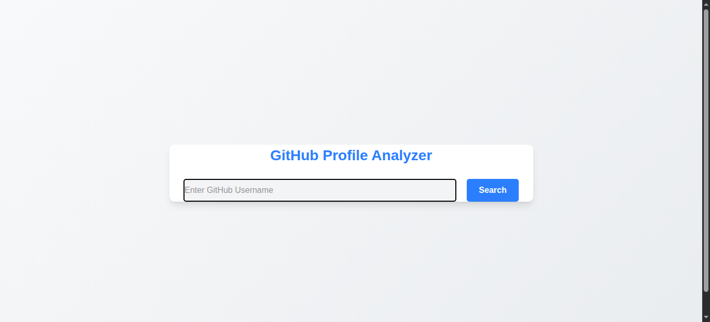
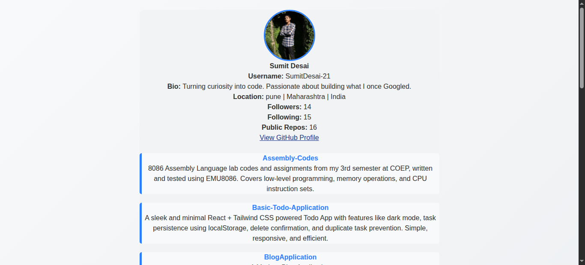
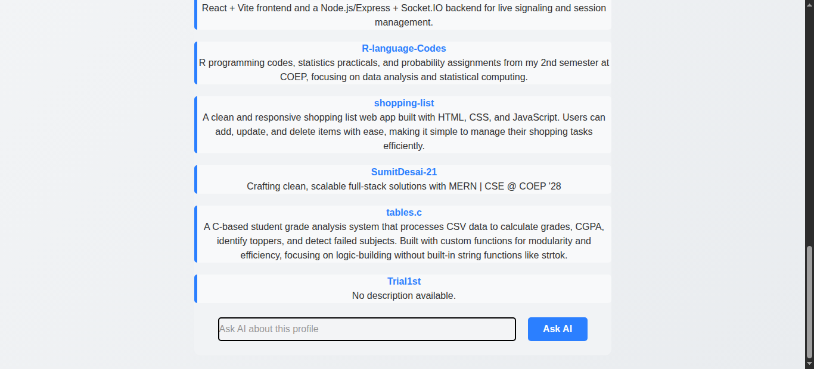
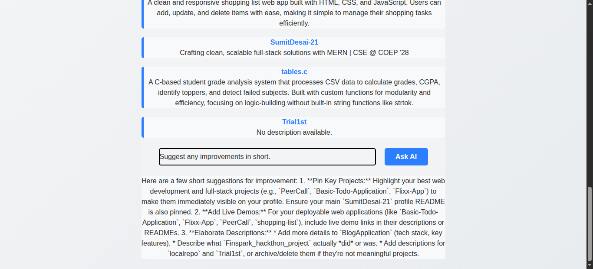

# GitHub Profile Analyzer

An AI-powered GitHub Profile Analyzer built during the CodTech IT Solutions Internship. The application allows users to search GitHub profiles, view repository information, and ask AI-powered questions about a developer's profile and projects.

---

## Internship Details

- **Full Name:** Sumit Vitthal Desai
- **Intern ID:** CITS1120
- **Duration:** 6 Weeks
- **Project Name:** GitHub Profile Analyzer

---

## Project Scope

The objective of this project was to develop a full-stack web application capable of:

- Fetching GitHub user profile information using the GitHub REST API.
- Displaying repository details of a GitHub user.
- Integrating Google's Gemini AI to analyze GitHub profiles.
- Allowing users to ask custom questions regarding a developer's profile and repositories.
- Providing a responsive and user-friendly interface.

---

## Features

- Search GitHub profiles by username.
- View profile details:
  - Name
  - Username
  - Bio
  - Followers
  - Following
  - Public Repositories
  - Profile Link
- Display repositories with descriptions.
- AI-powered profile analysis using Gemini AI.
- Responsive UI built with Tailwind CSS.
- Full-stack architecture using React and Express.

---

## Tech Stack

### Frontend
- React.js
- React Router
- Tailwind CSS

### Backend
- Node.js
- Express.js

### APIs
- GitHub REST API
- Google Gemini API

---

## Project Structure

```text
GitHub-Analyzer/
│
├── client/
│   ├── src/
│   └── assets/
│
├── server/
│   ├── config/
│   └── server.js
│
└── README.md
```

---

## Source Code

The complete source code is included in this repository.

---

## Installation & Setup

### Clone Repository

```bash
git clone <repository-url>
cd GitHub-Analyzer
```

### Frontend Setup

```bash
cd client
npm install
npm run dev
```

### Backend Setup

```bash
cd server
npm install
npm run dev
```

### Environment Variables

Create a `.env` file inside the server directory:

```env
GEMINI_API_KEY=YOUR_API_KEY
```

---

## Output Images

### Home Page



### Profile Information



### Repository Analysis



### AI Integration



---

## Documentation

### Workflow

1. User enters a GitHub username.
2. Application fetches profile information using GitHub API.
3. Application retrieves repositories.
4. User can ask questions about the profile.
5. Backend sends profile and repository data to Gemini AI.
6. Gemini generates insights and responses.
7. Results are displayed on the frontend.

### API Endpoints

#### Analyze Profile

```http
POST /api/analyze
```

Request Body:

```json
{
  "query": "What are this user's strongest skills?",
  "profileData": {},
  "repoData": []
}
```

Response:

```json
{
  "success": true,
  "data": "AI Generated Analysis"
}
```
---

## Author

**Sumit Desai**
Intern ID: CITS1120
